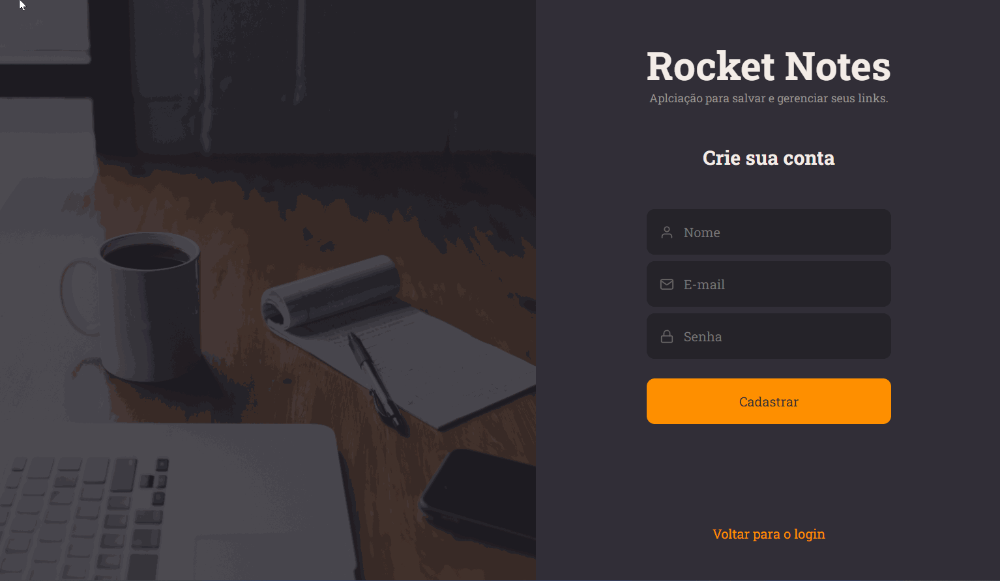
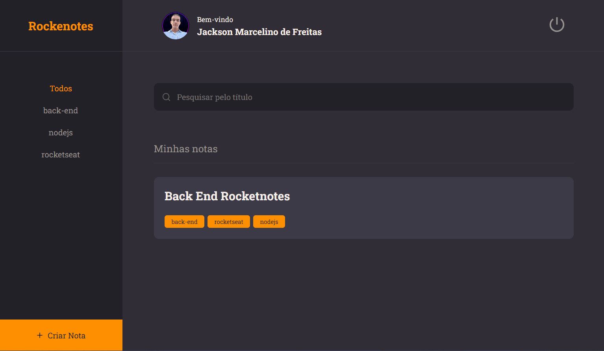
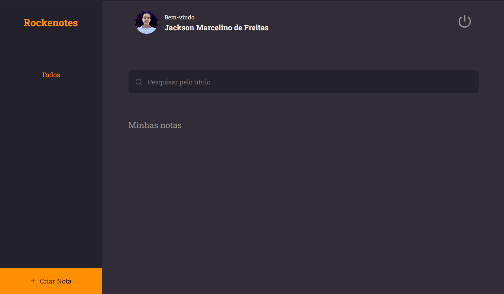
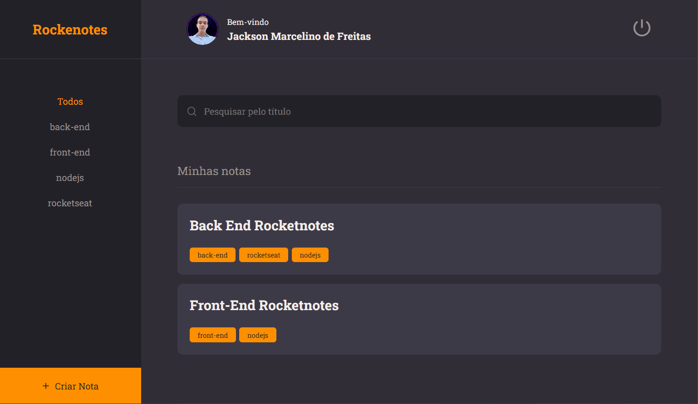

#

<h2 align="left">🔰Login page<h1>

#

<h2 align="left">🔰Create note One<h1>

#

<h2 align="left">🔰Create note Two<h1>

#

<h2 align="left">🔰Edit profile<h1>

#

<h2 align="left">🔰Logout page<h1>

<h1 align="center">Tecnologies<h1>

🔹 NodeJS 🔹 ViteJs 🔹 ReactJs 🔹 JavaScript 🔹 HTML 🔹 CSS 🔹 SQLite

