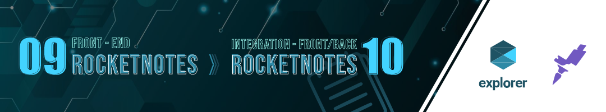
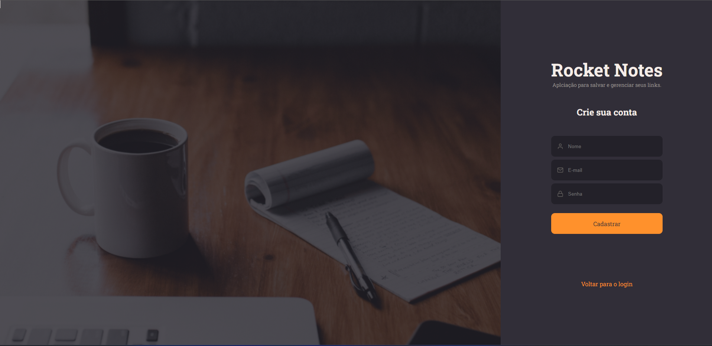

#

<h2 align="left">Login page<h1>

# 

<h2 align="left">Menu page<h1>

#

<h2 align="left">Profile page<h1>

#

<h2 align="left">Register page<h1>

#

<h2 align="left">Note creation page<h1>

<h1 align="center">Tecnologies<h1>

🔹 ViteJs 🔹 ReactJs 🔹 JavaScript 🔹 HTML 🔹 CSS

